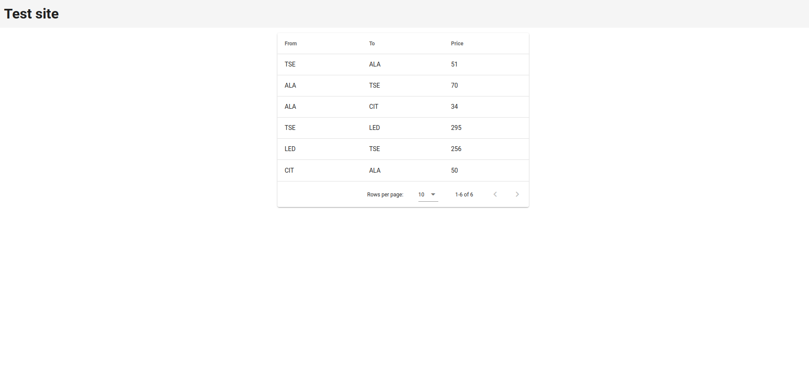

# TechTask

To start build with:
```
docker-compose build
```

Then start containers with:

```
docker-compose up
```
Then after some time the table will be filled with data.


# This is the end result:
